# QSdkAndroid
Using android studio creating android plugin for Unity. 

## SoftWare

Unity version : 5.4.0p4


## Steps
**1**, Create an empty Android Project.
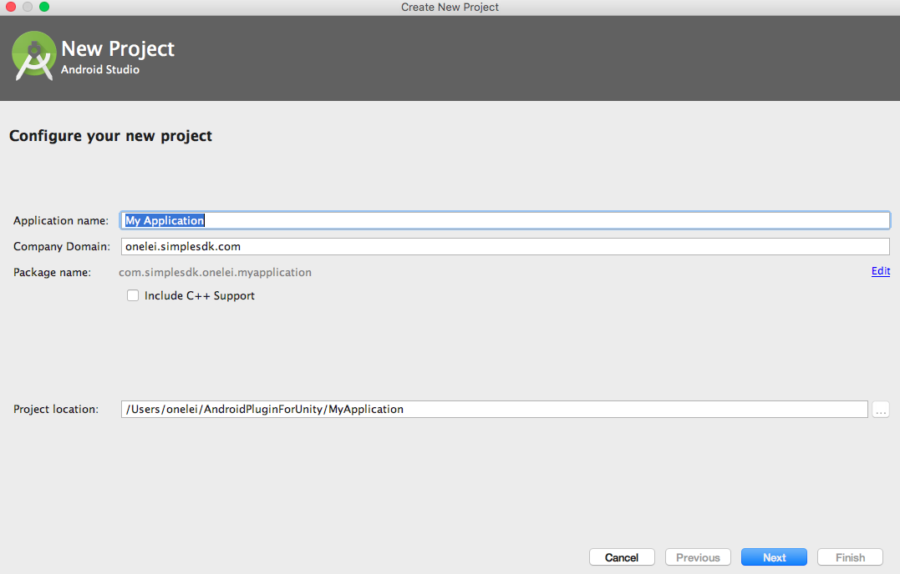
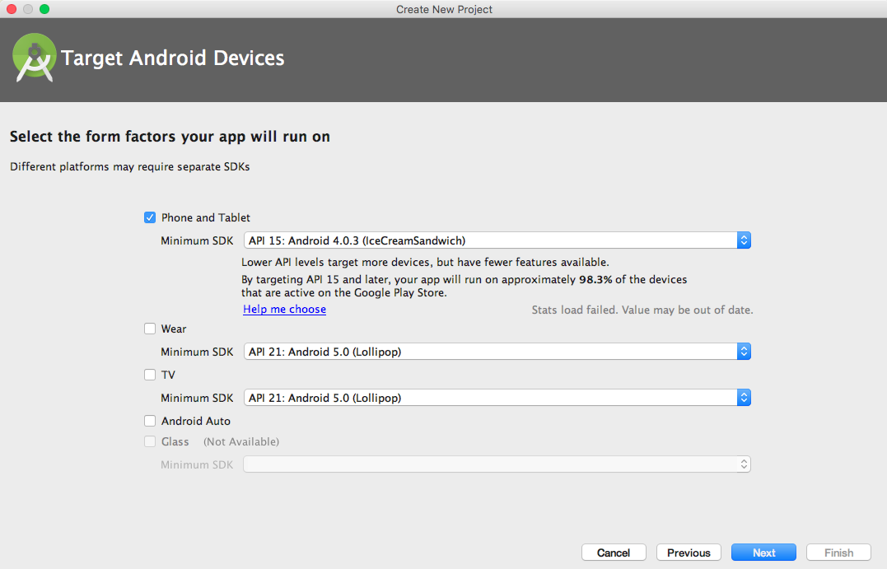
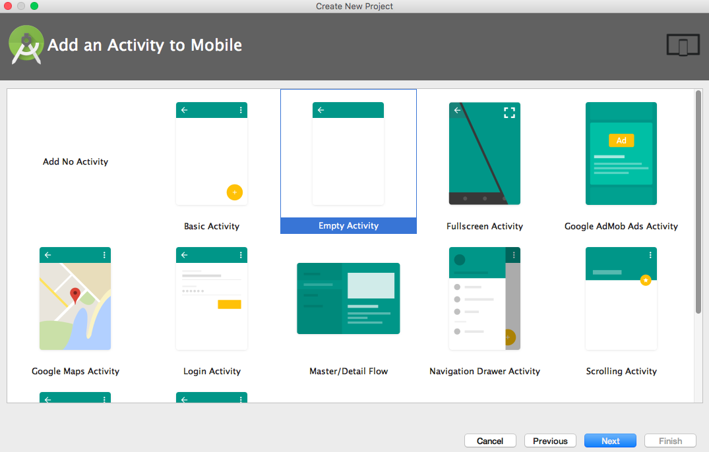
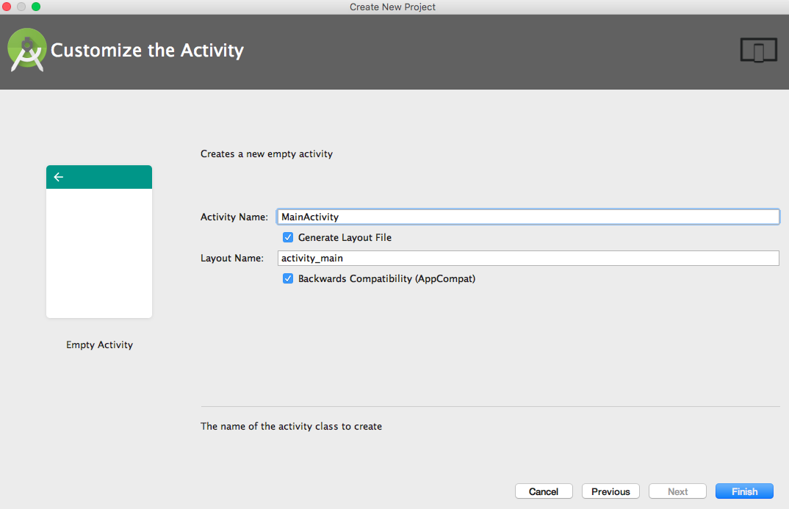

**2**, Create an empty Android Project.
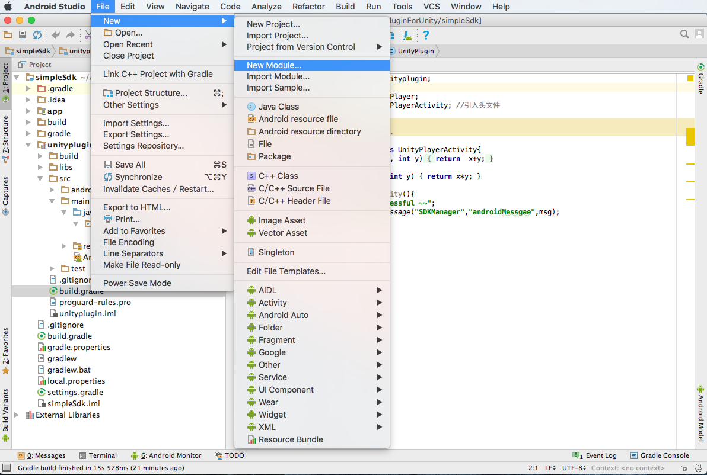
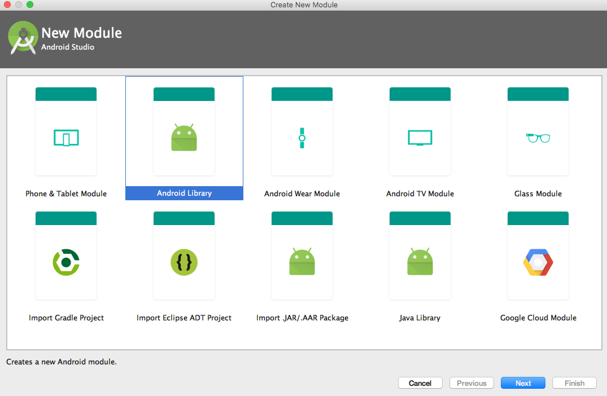
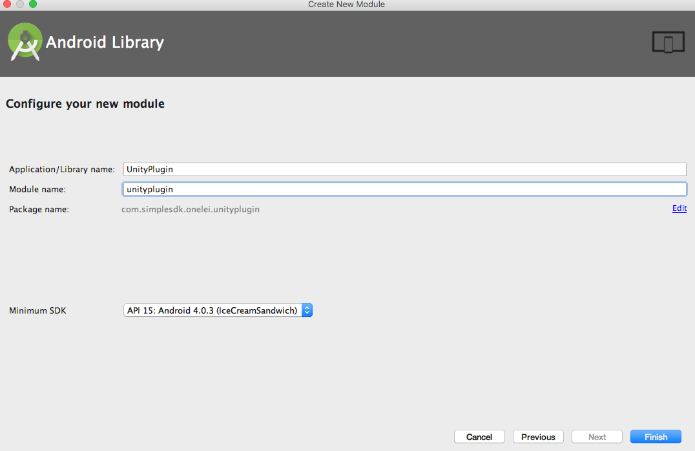

**3**, Copy the unity classes.jar   
win:  

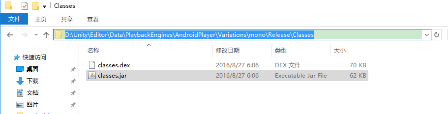  

mac:

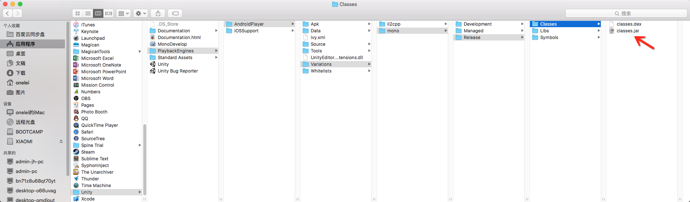
to
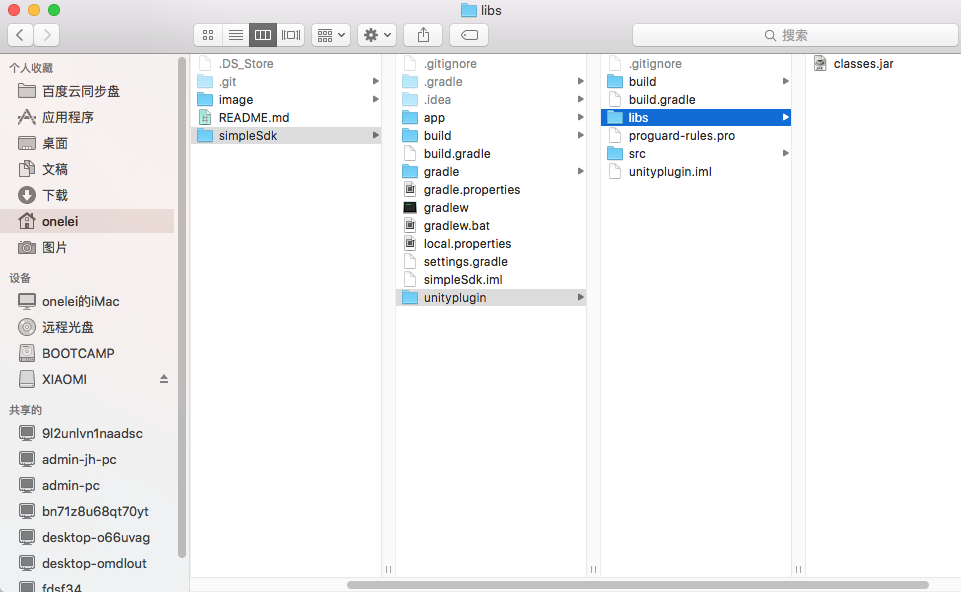
dictory.

**4**, include the classes.jar 
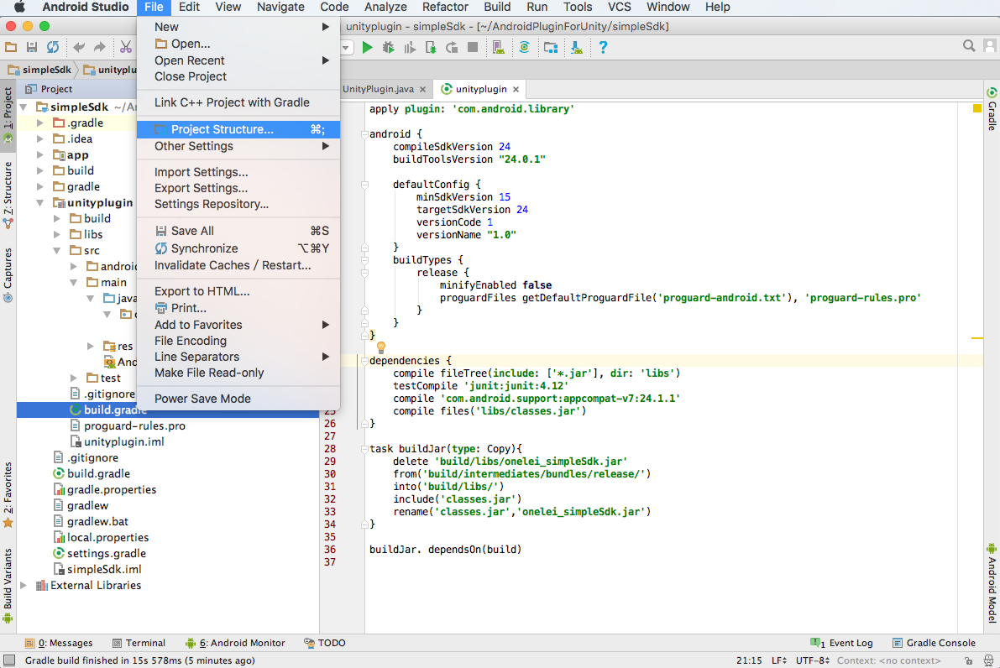
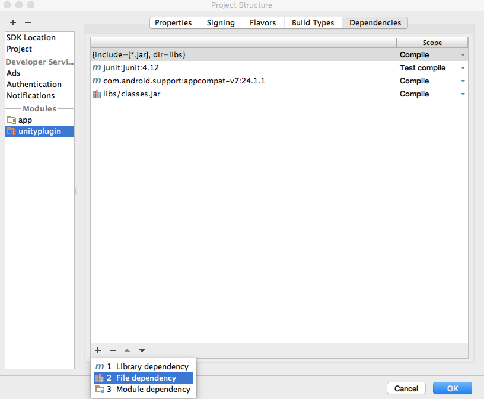
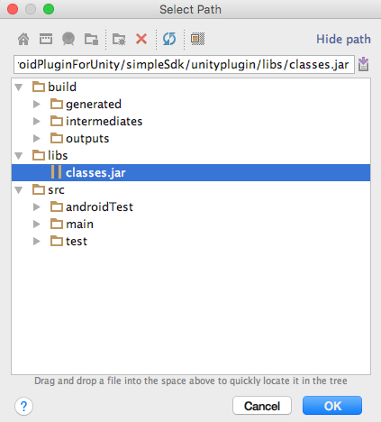

**5**, editor the android class 
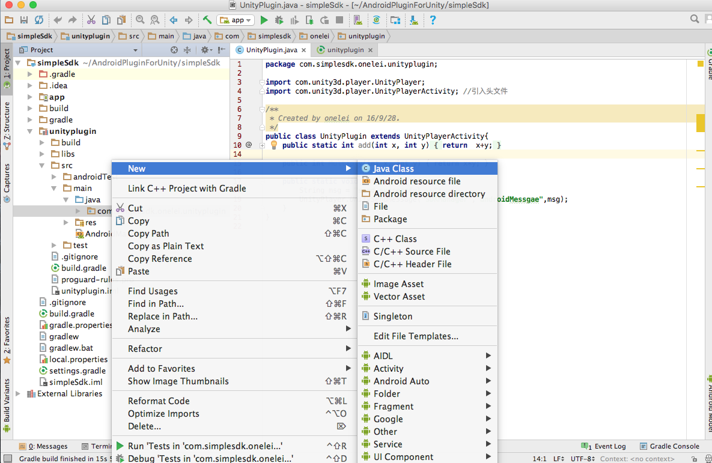
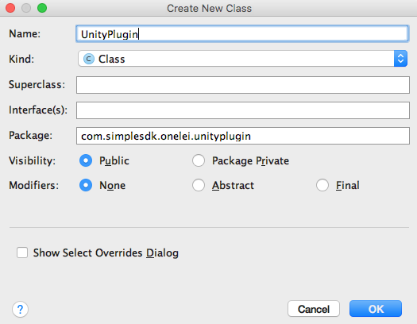
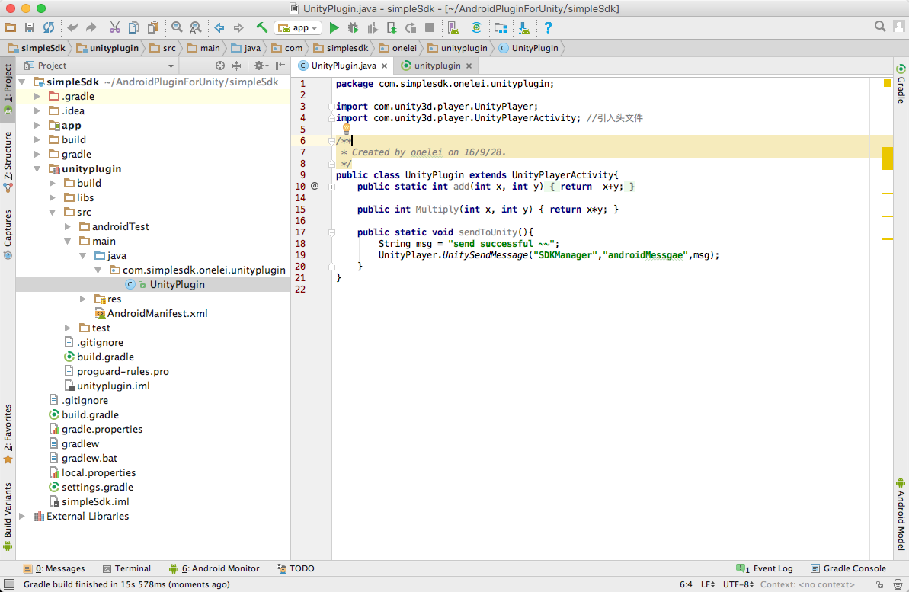

```
package com.onelei.unity;

import com.unity3d.player.UnityPlayer;
import com.unity3d.player.UnityPlayerActivity; //引入头文件

public class MainActivity extends UnityPlayerActivity{
    public static int add(int x, int y)
    {
        return  x+y;
    }

    public int Multiply(int x, int y) { return x*y; }

    public static void sendToUnity(){
        String msg = "send successful ~~";
        UnityPlayer.UnitySendMessage("SDKManager","androidMessgae",msg);
    }
}

```
**6**, compile the android project 
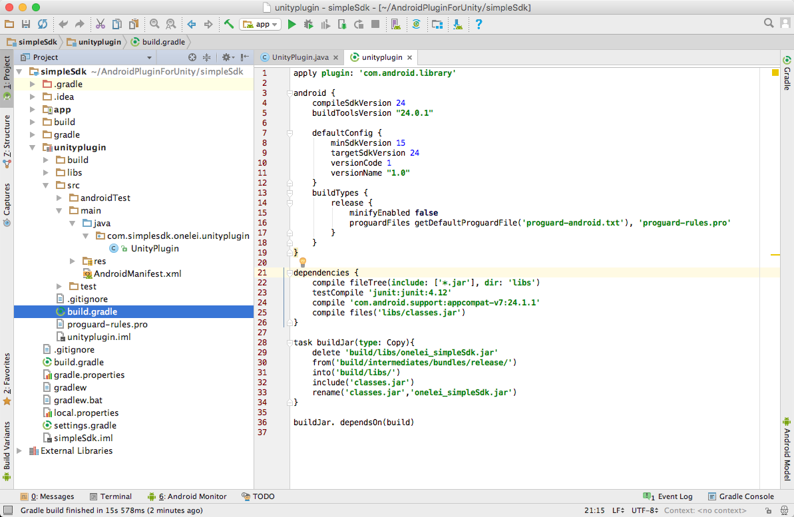

Terminal execute 

```
./gradlew buildJar
```
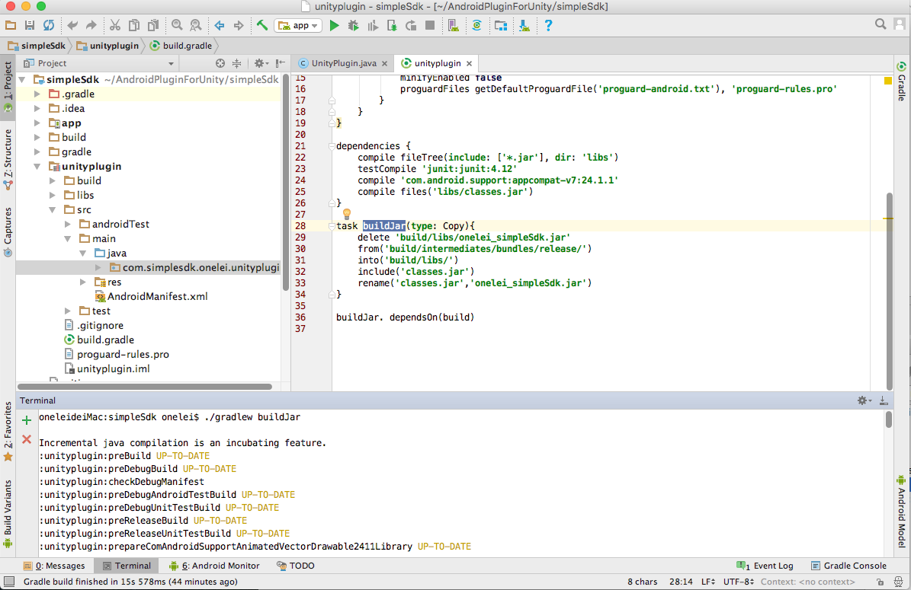
now you can find "onelei_simpleSdk.jar" under the "unityplugin\build\libs".

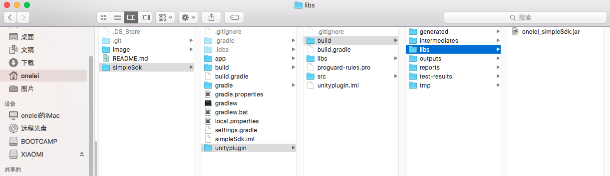

**7**, editor the unity project, create floder "Plugins/Android" under the "Assets". 
And create "AndroidManifest.xml" under "Plugins/Android".


**8**, editor the "AndroidManifest.xml",in the unity project. 

```
<manifest xmlns:android="http://schemas.android.com/apk/res/android" >
    <application
        android:allowBackup="true"
        android:icon="@drawable/app_icon"
        android:label="@string/app_name"
        android:supportsRtl="true">
        
        <activity 
            android:name="com.onelei.unity.MainActivity"  
            android:configChanges="locale|keyboardHidden|orientation|screenSize"
            android:screenOrientation="landscape"
            android:theme="@android:style/Theme.NoTitleBar.Fullscreen" >
            <intent-filter>
                <action android:name="android.intent.action.MAIN" />

                <category android:name="android.intent.category.LAUNCHER" />
            </intent-filter>
        </activity>  
        
    </application>

</manifest>

``` 
 
## How to use

Here are the simple sdk unity project .

