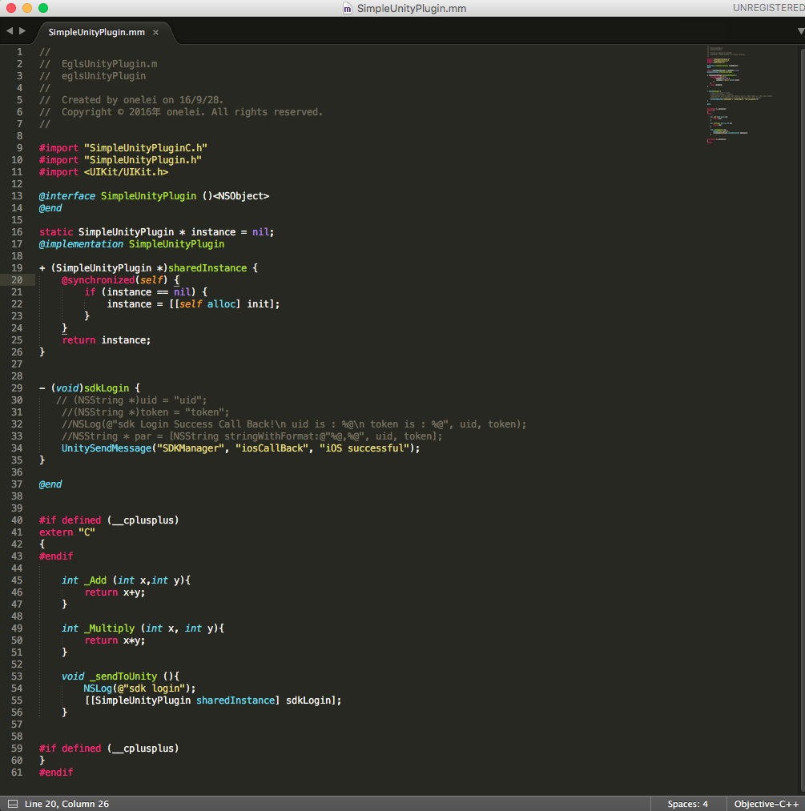
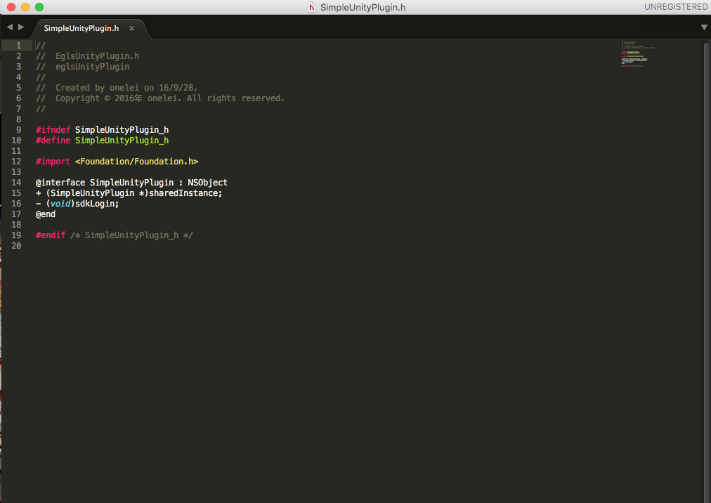
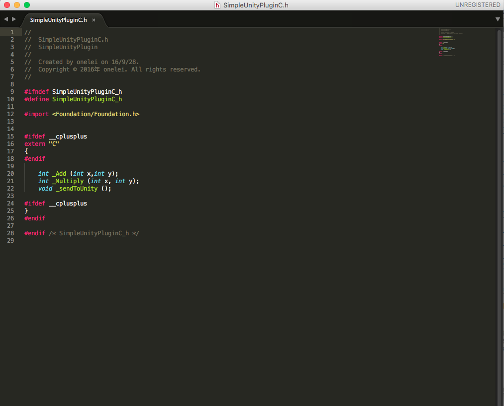

# QSdkIOS
 Using xcode creating ios plugin for Unity. 
 
## SoftWare

Unity version : Unity 2017.4.30f1 (64-bit)

## Files
**"QSdkUnityPlugin.mm"**: For the ObjectC and C.

**"QSdkUnityPlugin.h"**: For the ObjectC.

**"QSdkUnityPluginC.h"**: For the C.

## How to use

Here are the simple sdk unity project .