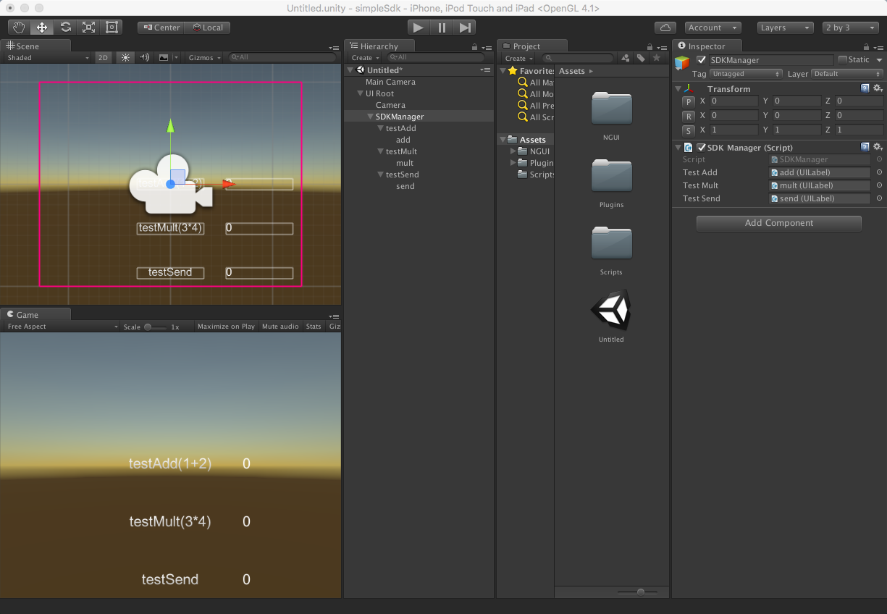
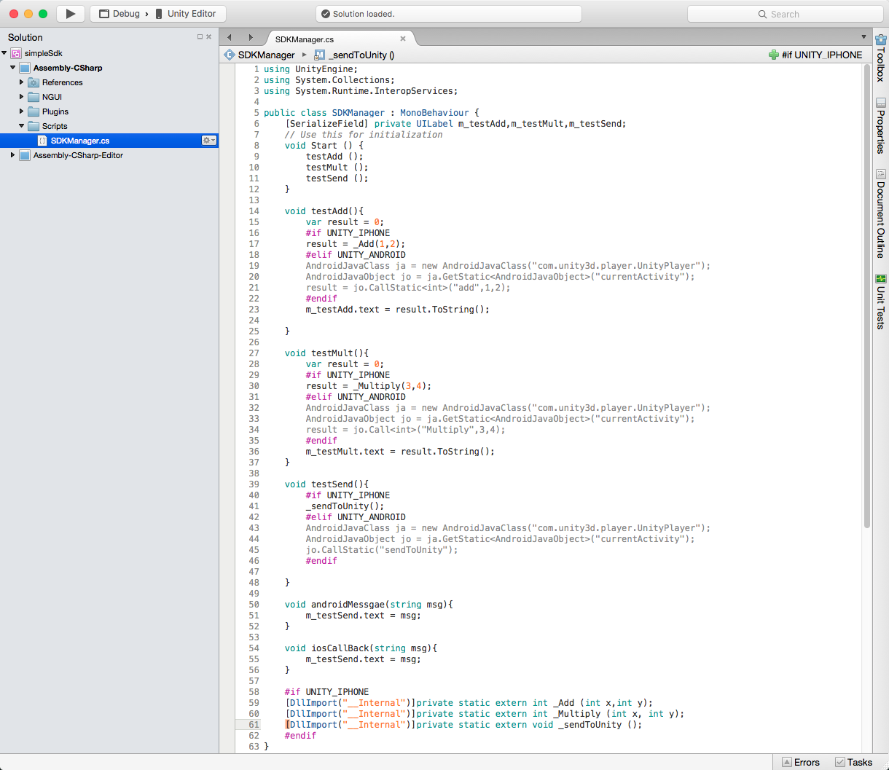

# simpleSdk

## Overview

**simpleSdk**, the simple sdk guide for *unity developers*.

## Directory

**android**, the plugin of unity for Android, a android jar project using Android Studio.		
**ios**, the plugin of unity for IOS.

**unity**, the simple unity project for how to using the android and ios sdk.

**image**, the picture for simplesdk.
 
## How to use

Here are the simple sdk unity project.

**Notice:**  The SDKManager must below the UIPanel Scripts.

## Result

Andriod :

IOS :

