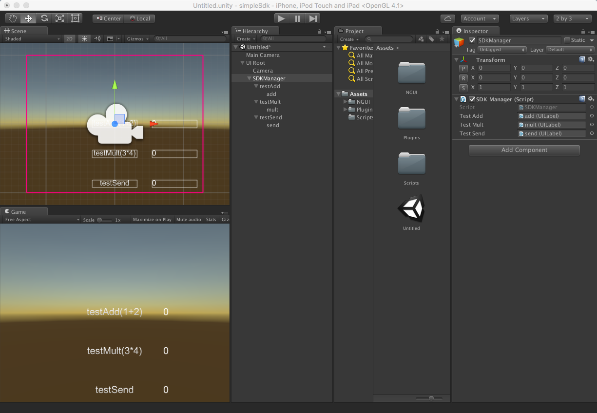
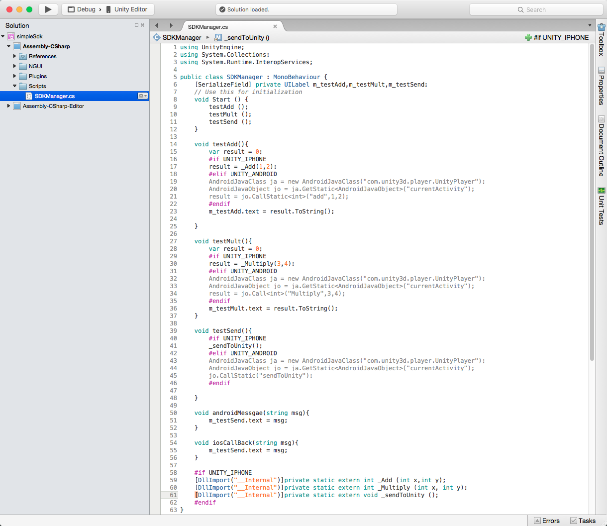
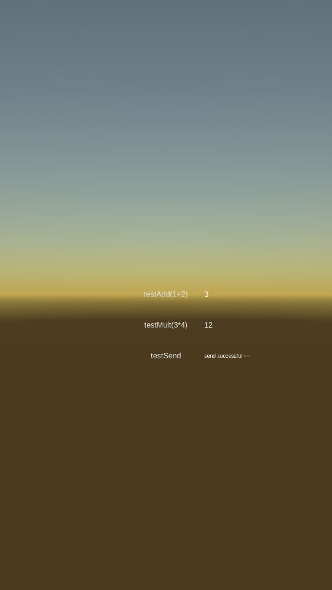
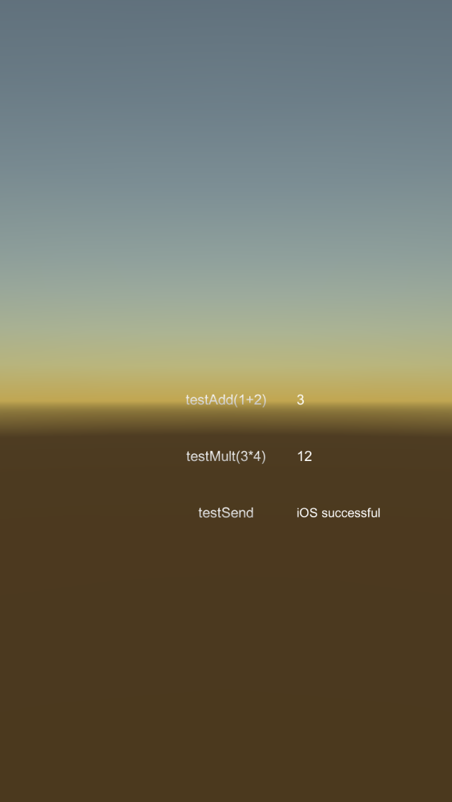

# QSdk

**QSdk**, the simple sdk guide for *unity developers*.

## SoftWare

Unity version : 5.4.0p4

## 文档

* [android](./QSdkAndroid/README.md) ： a android jar project using eclipse.
* [ios](./QSdkIOS/README.md) ： ios project using xcode.
* [unity] ： the simple unity project for how to using the android and ios sdk.
  
## How to use

Here are the simple sdk unity project.

**Notice:**  The SDKManager must below the UIPanel Scripts.

## Result

Andriod :

IOS :

