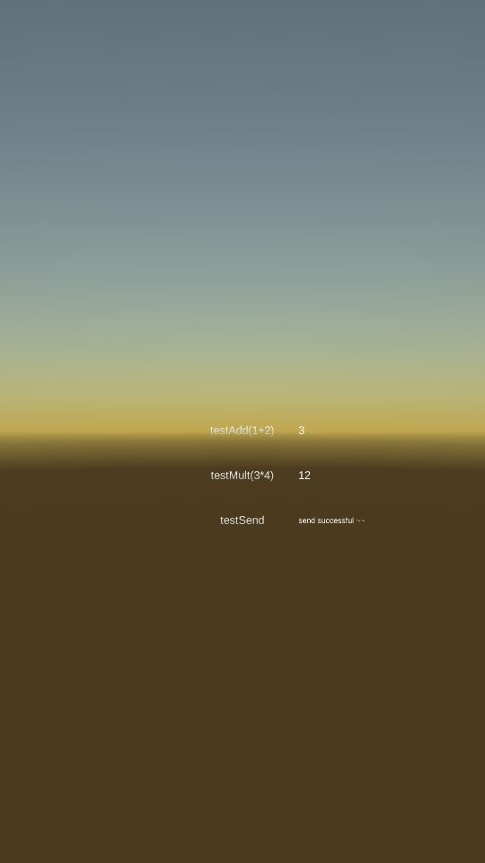

# QSdk

**QSdk**, the simple sdk guide for *unity developers*.

## SoftWare

Unity version : Unity 2017.4.30f1 (64-bit)

## Directory

**android**, the plugin of , a android jar project using Android Studio.   

**ios**, the plugin of .

**unity**, the simple unity project for how to using the android and ios sdk.

**image**, the picture for QSdk.
 
## How to use

Here are the simple sdk unity project.

**Notice:**  The SDKManager must below the UIPanel Scripts.

## Result

Andriod :

IOS :

